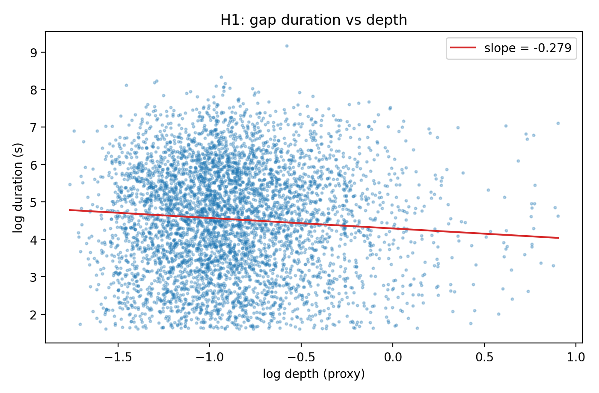
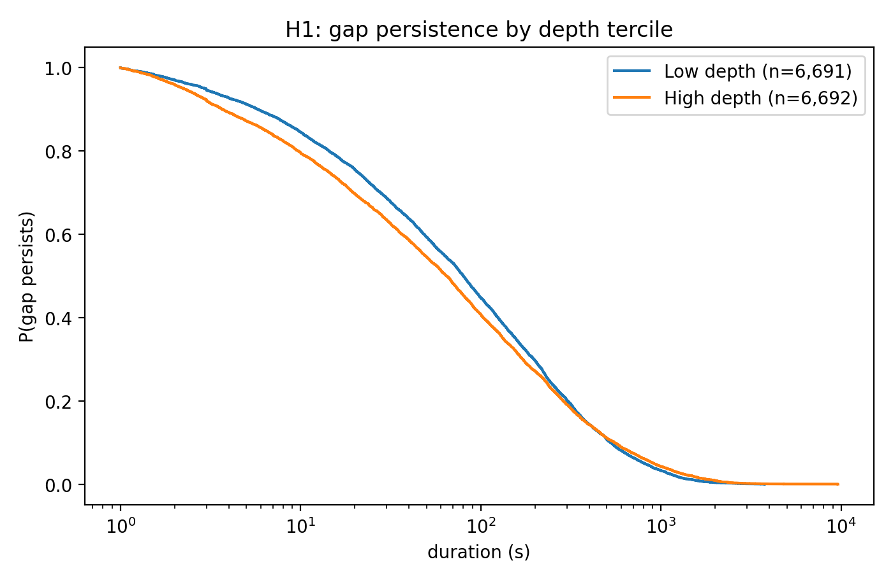

# Cross-chain ETH/USDC basis arbitrage: liquidity, latency and mean-reversion

*Author: Mohit Kumar Jassi*

*Parts of this work were submitted as part of my MSc Mathematical Finance dissertation at the University of Warwick. The code has since been refactored and extended.*

Python package, scripts and notebooks on ETH/USDC price gaps between Ethereum and Arbitrum (Uniswap v3): how long gaps last and
what drives it (H1), whether the mean-reversion half-life relative to bridge latency matters (H2), and what the available
liquidity-provider data can say about multi-chain LPs (H3).

Every number below is produced by a script in `scripts/`, stored in `results/`, and checked against this README by
`tests/test_readme_consistency.py`.

| Question | Where |
|---|---|
| **H1** Does deeper liquidity shorten gaps? | `01`, `run_h1.py` |
| **H2** Does half-life > latency change how much of a gap survives to settlement? | `02`, `run_h2.py` |
| **H3** What can the LP data say about multi-chain LPs? | `03`, `lp.py`, `run_data_checks.py` |
| Robustness of H1 and H2 | `06`, `run_robustness.py` |
| Extension: half-life of the actual Uniswap L2−L1 basis | `05`, `explore_uniswap_basis.py` |

## Method

Notation: $P_t$ and $V_t$ are the Binance close and volume of the 1 ms bar at tick $t$; $g_t$ is the Ethereum base fee (gwei).

**1. Series.** The H1/H2 series are built from the Binance bars (see *Data notes*):

$$b_t = P_t - \frac{1}{50}\sum_{k=0}^{49} P_{t-k}, \qquad D_t = \frac{1}{m_t}\sum_{k=0}^{m_t-1} V_{t-k}, \qquad S_t = \mathbf 1\lbrace g_t \ge Q_{0.95}(g)\rbrace $$

where $m_t$ is the number of available ticks in a window of at most 1,000 (at least 300 are required). Latency is drawn independently for every tick,
$\ell_t \sim \mathrm{LogNormal}(\hat\mu,\hat\sigma)$, with $(\hat\mu,\hat\sigma)$ the maximum-likelihood estimates on the observed bridge transfers
($\hat\mu = 4.495$, $\hat\sigma = 1.141$).

**2. Mean reversion.** On a grid of step $\Delta t$, fit the AR(1) $x_t = a + \varphi\thinspace  x_{t-1} + \varepsilon_t$ by OLS, where $x_t$ is the basis averaged onto the grid. This is the exact discretisation of an
Ornstein–Uhlenbeck process $dx_t = \kappa(\mu - x_t)\thinspace dt + \sigma\thinspace  dW_t$ with $\varphi = e^{-\kappa\Delta t}$, so the half-life is

$$\tau_{1/2} = \frac{\ln 2}{\kappa} = \frac{\Delta t\thinspace \ln 2}{-\ln \varphi}, \qquad \hat\varphi = 0.9328\ \Rightarrow\ \hat\tau_{1/2} = 9.97\text{ s}\quad(\Delta t = 1\text{ s}).$$

**3. Gap episodes.** A gap is a maximal run of consecutive ticks with $b_t > 0$. For gap $i$ let $t_i^s, t_i^e$ be its first and last tick, and define

$$T_i = t_i^e - t_i^s,\quad b_{0,i} = b_{t_i^s},\quad \bar D_i = \mathrm{mean}_{t \in i} D_t,\quad G_i = \mathrm{mean}_{t \in i} g_t,\quad S_i = \max_{t\in i} S_t,\quad \ell_i = \mathrm{median}_{t\in i} \ell_t .$$

Gaps with $T_i < 5$ s are dropped.

**4. H1 (depth and duration).** A log-log regression, estimated by OLS with HC1 and day-clustered standard errors:

$$\ln T_i = \alpha + \beta \ln \bar D_i + \gamma_1 G_i + \gamma_2 S_i + \varepsilon_i .$$

$\beta$ is the elasticity of duration with respect to depth, so doubling depth changes the typical duration by $2^{\beta} - 1$.

**5. H2 (timing and the retained gap).** Let $b_{\ell,i}$ be the last observed basis at or before $t_i^s + \ell_i$. The *retained gap* is $R_i = b_{\ell,i} - c$
(cost $c = 0$), the part of the gap still open at settlement; the *closure* is $C_i = b_{0,i} - b_{\ell,i}$, so $R_i = b_{0,i} - C_i$ when $c = 0$. With the timing indicator
$I_i = \mathbf 1\lbrace \tau_{1/2} > \ell_i\rbrace $,

$$R_i = \alpha + \theta\thinspace  b_{0,i} + \delta\thinspace  I_i + \eta\thinspace (b_{0,i} I_i) + \gamma_1 G_i + \gamma_2 S_i + \varepsilon_i,
\qquad R_i = \alpha + \lambda\thinspace (\tau_{1/2} - \ell_i) + \theta\thinspace  b_{0,i} + \gamma_1 G_i + \gamma_2 S_i + \varepsilon_i .$$

The slope on the initial gap is $\theta$ without and $\theta + \eta$ with $I = 1$, so $\eta > 0$ means more of the gap survives to settlement when the half-life exceeds the latency.
The second equation is the continuous version ($\lambda$ is the margin coefficient). Quantile regressions at $q = 0.25, 0.75$ fit
$Q_q(R_i) = \alpha + \theta\thinspace  b_{0,i} + \delta\thinspace  I_i + \gamma_1 G_i + \gamma_2 S_i$.

**6. Uniswap basis (extension).** The raw pool prices embed the WETH/USDC decimals factor, so $P^{L1}_t = 10^{12} / m^{eth}_t$, $P^{L2}_t = 10^{12}\thinspace  m^{arb}_t$ and
$b^{U}_t = P^{L2}_t - P^{L1}_t$, whose half-life is estimated as in step 2 on a last-observation-carried-forward grid. The share of observed transfers that settle faster than a half-life $\tau$ is
$\hat F(\tau) = \frac{1}{n}\sum_{j=1}^n \mathbf 1\lbrace \ell_j < \tau\rbrace $.

**7. H3 (LP cohorts).** Within each chain $c$ and week $w$ the loss column is scaled by a robust dispersion $s_{c,w}$ (the MAD, or $\mathrm{IQR}/1.349$, or the standard deviation, or 1,
the first that is positive), $\mathrm{LVR}^{rel}_j = \mathrm{LVR}_j / s_{c(j),w(j)}$, winsorised at the 1st and 99th percentiles. With $M_j = 1$ if wallet $j$ is active on both chains,

$$\mathrm{LVR}^{rel}_j = \alpha + \beta M_j + \gamma \ln(1 + \mathrm{dwell}_j) + \mu_{c(j)} + u_j .$$

The package also implements Mann–Whitney and Kolmogorov–Smirnov cohort tests and a Fisher exact test on the left tail. For raw mint/burn data, `lp.build_lvr_panel` computes a position's token amounts from its
liquidity $L$ and tick band, with $p(i) = 1.0001^i$,

$$x = L\left(p_l^{-1/2} - p_u^{-1/2}\right), \qquad y = L\left(p_u^{1/2} - p_l^{1/2}\right),$$

and sets $\mathrm{LVR}_j = V(\text{entry position}, p^{exit}) - V(\text{exit position}, p^{exit})$ with both positions valued at the exit price. That change in position value at a fixed price is not loss-versus-rebalancing in the
continuous-time sense, and none of the reported H3 numbers use this function (they use the supplied LP table).

## Results

**H1 — depth and gap duration.** In 17,988 gap episodes of at least 5 s (12 March – 30 June 2023), the elasticity of duration with
respect to depth is **−0.279** (HC1 SE 0.028; day-clustered SE 0.086, p = 0.001). A doubling of depth goes with a duration about
18% shorter. The coefficient is negative in all 17 specifications (−0.21 to −0.46), including day fixed effects, other depth windows,
winsorised depth and negative-basis gaps. Two limits: depth measured over the *next* 1,000 ticks gives the same coefficient (−0.279),
so this is an association rather than an identified causal effect; and the log-rank comparison of the lowest and highest depth
terciles is only suggestive (p = 0.10).

Estimated H1 equation:

| Term | Coefficient | HC1 SE |
|---|---|---|
| log depth, $\beta$ | −0.2786 | 0.0276 |
| mean gas, $\gamma_1$ | −0.0097 | 0.0004 |
| gas-spike dummy, $\gamma_2$ | 0.6165 | 0.0645 |
| intercept, $\alpha$ | 4.6882 | 0.0285 |

*N = 17,988; adjusted R² = 0.027.*

<p align="center">
  
  
</p>

**Mean reversion.** The proxy basis has an OU half-life of **9.97 s** on a 1 s grid. It depends on the sampling grid: 5.3 s at 0.5 s,
10.0 s at 1 s, 18.9 s at 2 s and 39.0 s at 5 s.

**H2 — timing and the retained gap.** The retained gap (the basis still open at settlement) rises with the margin half-life − latency
(+0.0014 per second, p < 0.001), and the half-life > latency interaction is positive whenever a minimum episode duration is imposed (+0.16 to +1.19) but negative (−0.49) when all episodes are used, so its sign depends on how very short episodes are treated. The evidence for the interaction is weak: only 2 of 17,988 episodes (4 of 20,074) have half-life > latency.
Enlarging the group by using the 5 s half-life grid gives 753 episodes and an interaction of +0.16, not significant (p = 0.26).
`fit_h2` warns whenever the treated group is small. Latency in the panel is simulated (see *Data notes*).

Estimated H2 equation (retained-gap outcome, main specification):

| Term | Coefficient | Day-clustered SE |
|---|---|---|
| initial gap $b_0$, $\theta$ | 0.4137 | 0.0675 |
| timing $I$, $\delta$ | −0.3710 | 0.0391 |
| $b_0 \times I$, $\eta$ | 0.4585 | 0.0589 |
| mean gas, $\gamma_1$ | −0.0026 | 0.0006 |
| gas-spike dummy, $\gamma_2$ | 0.3740 | 0.0813 |
| intercept, $\alpha$ | 0.4888 | 0.0558 |

*N = 17,988, of which 2 treated. With so few treated episodes the standard error on $\eta$ is not informative.*

**Extension — the actual Uniswap basis.** Built directly from both pools' prices, the L2−L1 basis has a half-life of about
160–170 s (1 s, 5 s and 30 s grids). In the bridge-latency export, 72% of the 9,362 observed transfers settle faster than 169 s, against
0.01% faster than the proxy's 9.97 s. This is exploratory: it has no costs or depth, and quote times are irregular.

**H3 — multi-chain LPs.** The liquidity ledgers identify 1,733 wallets active on both chains (379 within March–June 2023); 787 of the
11,093 wallets in the LP table (7.1%) are among them. Multi-chain wallets have far longer dwell times (median 1.8·10⁶ s versus 0 s); once
dwell time and chain are controlled the difference in the table's loss column is not significant (p = 0.11). That column is not a
usable loss measure (see *Data notes*), so the multi-chain question cannot be answered with this data.

## Robustness

`scripts/run_robustness.py` (notebook `06`) re-estimates H1 and H2 under alternative choices; the full tables are in `results/`.

**H1 — depth elasticity, 17 specifications.** The coefficient on log depth is negative in every one (−0.21 to −0.46) and significant at the 5% level in all but the 1,003 episodes that coincide with a gas spike.

| Specification | N | Elasticity $\beta$ | Day-clustered SE |
|---|---|---|---|
| file spike flag, >= 1s | 20,074 | −0.429 | 0.140 |
| file spike flag, >= 1s, winsorised depth | 20,074 | −0.442 | 0.146 |
| file spike flag, >= 5s | 17,988 | −0.264 | 0.086 |
| file spike flag, >= 5s, winsorised depth | 17,988 | −0.273 | 0.090 |
| recomputed p95 flag, >= 1s | 20,074 | −0.449 | 0.141 |
| recomputed p95 flag, >= 1s, winsorised depth | 20,074 | −0.462 | 0.147 |
| recomputed p95 flag, >= 5s | 17,988 | −0.279 | 0.086 |
| recomputed p95 flag, >= 5s, winsorised depth | 17,988 | −0.288 | 0.089 |
| within-day top-decile spike rule, >= 5s | 17,988 | −0.279 | 0.088 |
| negative-basis gaps, >= 5s | 17,733 | −0.304 | 0.069 |
| gas-spike episodes only | 1,003 | −0.225 | 0.312 |
| non-spike episodes only | 16,985 | −0.288 | 0.090 |
| day fixed effects | 17,988 | −0.209 | 0.083 |
| depth at episode entry (trailing window, predetermined) | 17,988 | −0.264 | 0.085 |
| FALSIFICATION: forward-looking depth at entry | 17,983 | −0.279 | 0.080 |
| depth proxy window = 500 ticks | 17,988 | −0.303 | 0.080 |
| depth proxy window = 2000 ticks | 17,980 | −0.271 | 0.092 |

The forward-looking row averages volume over the 1,000 ticks *after* the gap opens; it gives the same coefficient as the trailing measure, so the estimate is an association rather than an identified causal effect.

**H2 — timing interaction, 8 specifications** (retained-gap outcome, interaction $\eta$).

| Specification | Treated episodes | Interaction $\eta$ | Clustered p |
|---|---|---|---|
| baseline: I = 1{half-life > median latency} | 4 | +1.189 | 0.014 |
| trim latency at p99 | 4 | +1.187 | 0.014 |
| within-episode p95 latency in I | 1 | not estimable | – |
| half-life from 0.5s grid (5.3s) | 0 | not estimable | – |
| half-life from 2s grid (18.9s) | 58 | +0.732 | <0.001 |
| half-life from 5s grid (39.0s) | 753 | +0.156 | 0.259 |
| episodes >= 5s only | 2 | +0.459 | <0.001 |
| all episodes, no minimum duration | 6 | −0.494 | <0.001 |

The sign of the interaction depends on the minimum episode duration: it is positive when episodes of at least 1 s or 5 s are used and negative (−0.494) when every episode is used (22,758 episodes, 6 treated). Where the treated group has fewer than 100 episodes the clustered p-value is not informative, because the estimate rests on a handful of observations; the only specification with a sizeable treated group (the 5 s grid, 753 episodes) gives +0.156 and is not significant.
The continuous version, regressing the retained gap on half-life − latency over all episodes, has a coefficient of +0.0014 per second (SE 0.0002, p < 0.001). Quantile regressions of the retained gap on the timing indicator give +0.43 at $q = 0.25$ and −0.59 at $q = 0.75$, so the timing effect is not uniform across the distribution; these too rest on 4 treated episodes.

**Half-life.** It changes with the sampling grid (see *Mean reversion* above), so the 9.97 s figure refers specifically to the 1 s grid.

## Data notes

1. **H1/H2 series are proxies.** `basis_t` is the Binance close minus its 50-tick moving average, `depth` a rolling mean of Binance
   volume, and `latency_t` an independent random draw for each tick (`results/data_checks.json` verifies each definition). They stand in
   for the Uniswap L2−L1 basis, on-curve depth and matched bridge events, and results describe these series.
2. **Latency draws.** They come from a lognormal fitted by maximum likelihood to 9,362 observed bridge transfers. The fit is rough
   (KS statistic 0.27): the fitted median is 90 s but the observed median is 49 s, and the fitted 99th percentile is 1,272 s against
   an observed 699 s.
3. **Uniswap prices are in raw units.** After `prices.to_usd` they track Binance closely (correlation 0.999).
4. **LP data.** The table's loss column has a median absolute value of 2.6·10²², which is not a plausible USD amount, and the 2,642 rows
   with |value| < 10⁴ are all exactly zero. The table has one row per wallet, so it cannot identify multi-chain wallets by itself. The
   ledgers span 2021–2024 (12–15% of rows fall in March–June 2023), and 30% of Arbitrum ledger rows have a negative cumulative
   liquidity, which is impossible for real positions, so they cannot be used to value positions.
5. **Two gas-spike flags.** The flag stored in the data marks 9.2% of ticks; the recomputed 95th-percentile rule marks 5.0%. Both are
   reported in `06`.
6. **ROI.** `episodes.add_roi` offers the retained gap `b_l − cost` (default) and the closure `b_0 − b_l`, with `retained = b_0 − closure`.
   Costs default to zero.
7. Single pair, single bridge. The H1/H2 panel covers 12 March – 30 June 2023.

## Next steps

- Repeat H1 and H2 on the Uniswap L2−L1 basis (notebook 05), with transaction costs.
- Replace the simulated latency by latencies matched to bridge events.
- Build a valid LP loss measure from token-level mint, burn and swap data; `lp.build_lvr_panel` is ready for that input.

## Layout

```
src/crosschain_arb/   config, io, panel, prices, halflife, episodes, models, robustness, checks, lp, plots
scripts/              run_h1  run_h2  run_h3  run_robustness  run_data_checks  explore_uniswap_basis
notebooks/            01 H1 · 02 H2 · 03 H3 · 04 data checks · 05 Uniswap-basis extension · 06 robustness (executed)
tests/                unit tests on synthetic data; integration tests run when data/ is present
results/              JSON/CSV summaries and figures produced by the scripts
data/                 inputs are not tracked; see data/README.md
```

## Quick start

```bash
pip install -e ".[dev]"
# put the data files in data/ (see data/README.md), then, in this order:
python scripts/run_h1.py
python scripts/run_h2.py
python scripts/explore_uniswap_basis.py
python scripts/run_robustness.py
python scripts/run_data_checks.py
pytest
```

```python
from crosschain_arb.io import load_panel
from crosschain_arb.panel import add_gas_spike
from crosschain_arb.episodes import build_gap_episodes
from crosschain_arb.models import fit_h1

panel = add_gas_spike(load_panel())
print(fit_h1(build_gap_episodes(panel, min_seconds=5.0)))
```

## Engineering notes

- Pure functions with type hints and docstrings; paths and constants in `config.py` (`CCARB_DATA` overrides the data folder).
- `panel.build_proxy_panel` rebuilds the tick panel from the merged Binance/gas data; an integration test checks it against the shipped panel.
- Unit tests cover episode logic on hand-built panels, half-life recovery on simulated AR(1) series, regression recovery on synthetic data,
  the LP routines, the robustness suite and the data checks.
- A GitHub Actions workflow (`.github/workflows/ci.yml`) runs `ruff` and `pytest`.

## Data and licence

Binance data and the bridge-latency export are third-party and are not included; check their terms before redistributing them.
The code is released under the MIT licence (see `LICENSE`); the licence does not cover the third-party data.
